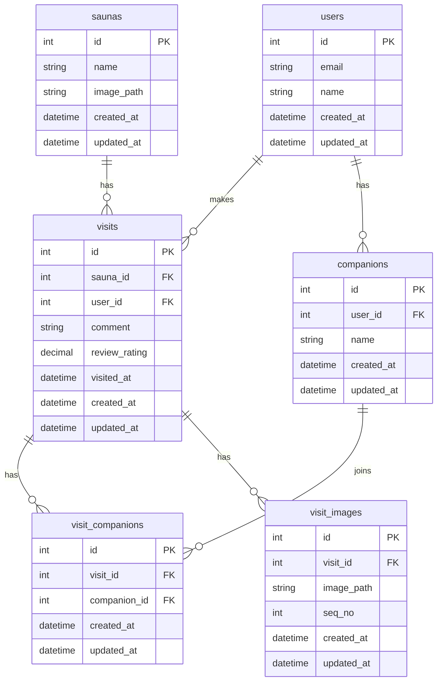

```mermaid
erDiagram

  visits {
    int id PK
    int sauna_id FK
    int user_id FK
    string comment
    decimal review_rating
    datetime visited_at
    datetime created_at
    datetime updated_at
  }

  visit_companions {
    int id PK
    int visit_id FK
    int companion_id FK
    datetime created_at
    datetime updated_at
  }

  visit_images {
    int id PK
    int visit_id FK
    string image_path
    int seq_no
    datetime created_at
    datetime updated_at
  }

  saunas {
    int id PK
    string name
    string image_path
    datetime created_at
    datetime updated_at
  }

  companions {
    int id PK
    int user_id FK
    string name
    datetime created_at
    datetime updated_at
  }

  users {
    int id PK
    string email
    string name
    datetime created_at
    datetime updated_at
  }

  users ||--o{ visits : makes
  saunas ||--o{ visits : has
  visits ||--o{ visit_companions : has
  visits ||--o{ visit_images : has
  companions ||--o{ visit_companions : joins
  users ||--o{ companions : has

```
